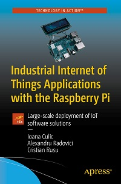

# Apress Source Code

This repository accompanies [*Industrial Internet of Things Applications with the Raspberry Pi: Large-scale Deployment of IoT Software Solutions*](https://www.apress.com/9781484257715) by Ioana Culic, Alexandru Radovici and Cristian Rusu (Apress, 2020).

[comment]: #cover

Download the files as a zip using the green button, or clone the repository to your machine using Git.

## Releases

Release v1.0 corresponds to the code in the published book, without corrections or updates.

## Contributions

See the file Contributing.md for more information on how you can contribute to this repository.